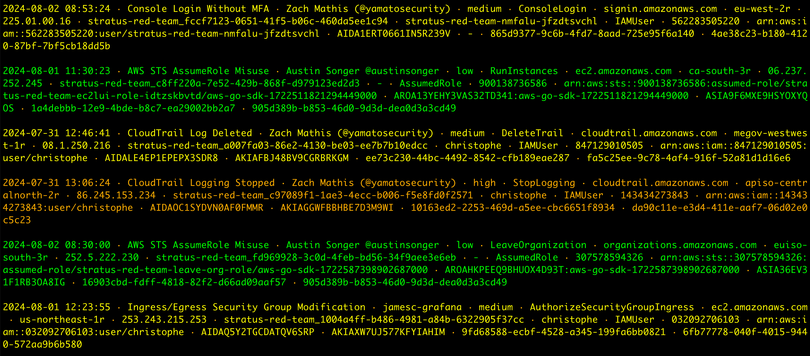

<div align="center">
 <p>
    
 </p>
  [<a href="README.md">English</a>] | [<b>日本語</b>]
</div>

---

<p align="center">
    <a href="Maintenance Level"></a>
    <a href="Total Commits"></a>
    <a href="https://twitter.com/SecurityYamato"></a>
</p>


# Suzaku について

Suzaku（朱雀）は、中国神話において、雲の上を飛び、南の天を支配する神である["Vermilion Bird"](https://en.wikipedia.org/wiki/Vermilion_Bird)を意味します。

Suzakuは、クラウドログのための脅威ハンティングおよび高速フォレンジックタイムライン生成ツールです。
（[Hayabusa](https://github.com/Yamato-Security/hayabusa)をWindowsイベントログではなくクラウドログ用にしたものを想像してください。） 
現在、AWS CloudTrailログに対する基本的なネイティブの[sigma](https://github.com/SigmaHQ/sigma)サポートを備えた形で積極的に開発が進められています。 
AWSの次には、AzureおよびGCPログのサポートを計画しています。

クラウドログには、数千もの異なるAPI呼び出しがあり、手動で確認するには膨大なイベントが存在します。 
Suzakuは、ノイズの中から攻撃を見つけるだけでなく、迅速なフォレンジック調査を行うために必要なイベントとデータのみを含むDFIRタイムラインを提供するよう設計されています。 
また、高レベルで何が起こったのかを迅速に発見し、攻撃者が行ったイベントを見逃さないようにするための要約や検索機能なども作成する予定です。

# 関連プロジェクト

* [suzaku-rules](https://github.com/Yamato-Security/suzaku-rules) - Suzakuのためのルールセット。Sigmaルールを使用して、Suzakuで検出できるようにします。
* [suzaku-sample-data](https://github.com/Yamato-Security/suzaku-sample-data) - Suzakuのサンプルデータセット。Suzakuを使用して、サンプルデータを分析することができます。

# 目次


- [Suzaku について](#suzaku-について)
- [関連プロジェクト](#関連プロジェクト)
- [目次](#目次)
- [スクリーンショット](#スクリーンショット)
  - [スタートアップ](#スタートアップ)
  - [DFIRタイムライン](#dfirタイムライン)
  - [検知頻度のタイムライン](#検知頻度のタイムライン)
  - [検知結果サマリ](#検知結果サマリ)
- [機能](#機能)
- [ダウンロード](#ダウンロード)
- [Gitクローン](#gitクローン)
- [アドバンス: ソースからのコンパイル (任意)](#アドバンス-ソースからのコンパイル-任意)
  - [Rustパッケージの更新](#rustパッケージの更新)
  - [macOSのコンパイルの注意点](#macosのコンパイルの注意点)
  - [Linuxのコンパイルの注意点](#linuxのコンパイルの注意点)
  - [LinuxのMUSLバイナリのクロスコンパイル](#linuxのmuslバイナリのクロスコンパイル)
- [Suzakuの実行](#suzakuの実行)
  - [Windows](#windows)
    - [パスにスペースが含まれるファイルまたはディレクトリをスキャンしようとするとエラーが発生した場合](#パスにスペースが含まれるファイルまたはディレクトリをスキャンしようとするとエラーが発生した場合)
    - [文字が正常に表示されない場合](#文字が正常に表示されない場合)
  - [Linux](#linux)
  - [macOS](#macos)
- [コマンドの一覧](#コマンドの一覧)
  - [分析コマンド](#分析コマンド)
  - [DFIRタイムラインコマンド](#dfirタイムラインコマンド)
  - [一般コマンド](#一般コマンド)
- [コマンドの使用方法](#コマンドの使用方法)
  - [分析コマンド](#分析コマンド-1)
    - [`aws-ct-metrics`コマンド](#aws-ct-metricsコマンド)
      - [`aws-ct-metrics`コマンドの例](#aws-ct-metricsコマンドの例)
  - [DFIRタイムラインコマンド](#dfirタイムラインコマンド-1)
    - [`aws-ct-timeline`コマンド](#aws-ct-timelineコマンド)
      - [`aws-ct-timeline`コマンドの例](#aws-ct-timelineコマンドの例)
- [貢献](#貢献)
- [バグの報告](#バグの報告)
- [ライセンス](#ライセンス)
- [コントリビューター](#コントリビューター)
- [謝辞](#謝辞)
- [Twitter](#twitter)

# スクリーンショット

## スタートアップ


## DFIRタイムライン



## 検知頻度のタイムライン


## 検知結果サマリ


# 機能

* クロスプラットフォームサポート: Windows、Linux、macOS
* Rustで開発され、安全で高速。
* `.json`または圧縮された`.json.gz`ファイルがスキャン可能。
* 単一のタイムラインを作成し、フォレンジック調査やインシデントレスポンスを容易にします。
* 読みやすく、作成や編集が簡単なYML形式の[Sigma](https://github.com/SigmaHQ/sigma)で記述されたIoCシグネチャに基づく脅威ハンティング。
* 結果をCSV、JSON、JSONL形式で保存可能。

# ダウンロード

最新の安定版Suzakuを、[Releases](https://github.com/Yamato-Security/suzaku/releases)ページからコンパイル済みバイナリとしてダウンロードするか、ソースコードをコンパイルしてください。

以下のアーキテクチャ向けにバイナリを提供しています:
- Linux ARM 64-bit GNU (`suzaku-x.x.x-lin-aarch64-gnu`)
- Linux Intel 64-bit GNU (`suzaku-x.x.x-lin-x64-gnu`)
- Linux Intel 64-bit MUSL (`suzaku-x.x.x-lin-x64-musl`)
- macOS ARM 64-bit (`suzaku-x.x.x-mac-aarch64`)
- macOS Intel 64-bit (`suzaku-x.x.x-mac-x64`)
- Windows ARM 64-bit (`suzaku-x.x.x-win-aarch64.exe`)
- Windows Intel 64-bit (`suzaku-x.x.x-win-x64.exe`)
- Windows Intel 32-bit (`suzaku-x.x.x-win-x86.exe`)

> [何らかの理由でLinux ARM MUSLバイナリが正常に動作しません](https://github.com/Yamato-Security/hayabusa/issues/1332) so we do not provide that binary. It is out of our control, so we plan on providing it in the future when it gets fixed.

# Gitクローン

`git clone`でリポジトリをクローンし、ソースコードからバイナリをコンパイルすることができます。

**警告** リポジトリのメインブランチは開発用であり、まだ正式にリリースされていない新機能にアクセスできますが、バグがある可能性があるため、安定版ではないと見なしてください。

```bash
git clone https://github.com/Yamato-Security/suzaku.git --recursive
```

> **注意:** `--recursive`オプションを忘れると、`rules`フォルダがgitサブモジュールとして管理されているため、クローンされません。

`rules`フォルダは、gitサブモジュールとして管理されているため、`git pull --recurse-submodules`で最新のSuzakuルールを取得できます。

```bash
./suzaku update-rules
```

更新に失敗したら、`rules`フォルダの名前を変更して、もう一度試してください。

>>警告: 更新時に、rulesフォルダ内のルールおよび設定ファイルは、suzaku-rulesリポジトリ内の最新のルールおよび設定ファイルに置き換えられます。
>>既存のファイルに加えた変更は上書きされるため、更新前に編集したファイルのバックアップを作成することをお勧めします。
>>ただし、rulesフォルダ内に**新しい**ルールを追加した場合、それらは更新時に上書きまたは削除されることはありません。

# アドバンス: ソースからのコンパイル (任意)

Rustがインストールされている場合、以下のコマンドでソースコードからコンパイルできます。

注意: コンパイルには通常、最新バージョンのRustが必要です

```bash
cargo build --release
```

最新の開発版はメインブランチから、または最新の安定版は[Releases](https://github.com/Yamato-Security/suzaku/releases)ページからダウンロードできます

Rustを定期的に更新してください:

```bash
rustup update stable
```

コンパイルされたバイナリは`./target/release` フォルダに作成されます。

## Rustパッケージの更新

コンパイルする前に、最新のRustクレートに更新できます:

```bash
cargo update
```

> アップデート後に何かが壊れた場合は、お知らせください。

## macOSのコンパイルの注意点

opensslのコンパイルエラーが発生した場合は、[Homebrew](https://brew.sh/)をインストールし、次のパッケージをインストールしてください。

```bash
brew install pkg-config
brew install openssl
```

## Linuxのコンパイルの注意点

opensslのコンパイルエラーが発生した場合は、次のパッケージをインストールしてください。

Ubuntuベースのディストリビューション:

```bash
sudo apt install libssl-dev
```

Fedoraベースのディストリビューション:

```bash
sudo yum install openssl-devel
```

## LinuxのMUSLバイナリのクロスコンパイル

Linux OSでは、まずターゲットをインストールします。

```bash
rustup install stable-x86_64-unknown-linux-musl
rustup target add x86_64-unknown-linux-musl
```

Compile with:

```bash
cargo build --release --target=x86_64-unknown-linux-musl
```

> **警告: 新しい安定版のRustがリリースされるたびに、`rustup install stable-x86_64-unknown-linux-musl`を実行してください。そうしないと、クロスコンパイル用のコンパイラが更新されず、ビルドエラーが発生する可能性があります。**

MUSLバイナリは、`./target/x86_64-unknown-linux-musl/release/`ディレクトリに作成されます。
GNUバイナリよりも約15%遅くなりますが、Linuxの異なるバージョンやディストリビューション間での移植性が高くなります。

# Suzakuの実行

## Windows

コマンドプロンプトまたはPowerShellを開き、Suzakuのルートディレクトリに移動して、次のコマンドを実行します。

### パスにスペースが含まれるファイルまたはディレクトリをスキャンしようとするとエラーが発生した場合

コマンドプロンプトやPowerShellの組み込み機能を使用している場合、ファイルやディレクトリパスにスペースが含まれていると、Suzakuがファイルを読み込めないというエラーが表示されることがあります。
ログファイルを正しく読み込むために、以下を確認してください。
1. ファイルやディレクトリパスを二重引用符で囲んでいること
2. ディレクトリの場合、最後の文字にバックスラッシュを含めないこと

### 文字が正常に表示されない場合

デフォルトフォントの`Lucida Console`では、ロゴやテーブルで使用されるさまざまな文字が正しく表示されません。
`Consalas`フォントに変更することで、文字が正しく表示されます。

## Linux

バイナリに実行権限を付与します。

```bash
chmod +x ./suzaku
```

Suzakuのルートディレクトリから実行します。

```bash
./suzaku
```

## macOS

ターミナルや[iTerm2](https://iterm2.com/)で、最初にバイナリに実行権限を付与する必要があります。

```bash
chmod +x ./suzaku
```

そして、Suzakuのルートディレクトリから実行します。

```bash
./suzaku
```

最新のmacOSでは、実行しようとするとセキュリティエラーが表示されることがあります。
キャンセルをクリックして、から"セキュリティとプライバシー"を開き、Generalタブから"許可"をクリックします。
その後、再度実行してください。

```bash
./suzaku
```

警告のポップアップが表示されるので、"開く"をクリックしてください。
これでsuzakuを実行できるようになります。

# コマンドの一覧

## 分析コマンド
* `aws-ct-metrics`: AWS CloudTrailログのメトリクスを作成する

## DFIRタイムラインコマンド
* `aws-ct-timeline`: AWS CloudTrailログのDFIRタイムラインを作成する
* `update-rules`: Sigmaルールを更新する

## 一般コマンド
* `help`: コマンドのヘルプメニューを表示する

# コマンドの使用方法

## 分析コマンド

### `aws-ct-metrics`コマンド

このコマンドは、AWS CloudTrailログ内のフィールドに関するメトリクスを作成するために使用します。
デフォルトでは、`eventName`フィールドをスキャンします。
このコマンドは、現在、最も一般的なAPI呼び出しを特定するために使用されており、検出ルールの優先順位を決定するために使用されます。

```
Usage: suzaku aws-ct-metrics [OPTIONS] <--directory <DIR>|--file <FILE>>

Input:
  -d, --directory <DIR>  複数gz/jsonファイルのディレクトリパス
  -f, --file <FILE>      gz/jsonファイルのパス

Output:
  -F, --field-name <FIELD_NAME>  メトリクスを作成するフィールド [デフォルト: eventName]
  -o, --output <FILE>            CSVに保存

Display Settings:
  -K, --no-color  カラーで出力しない
  -q, --quiet     Quietモード: 起動バナーを表示しない

General Options:
  -h, --help  ヘルプメニューを表示する
  ```

#### `aws-ct-metrics`コマンドの例

* `eventName`のAPIコール数をテーブル形式で出力: `./suzaku aws-ct-metrics -d ../suzaku-sample-data`
* CSVに保存: `./suzaku aws-ct-metrics -d ../suzaku-sample-data -o sample-metrics.csv`

## DFIRタイムラインコマンド

### `aws-ct-timeline`コマンド

AWS CloudTrailのDFIRタイムラインを、`rules`フォルダ内のsigmaルールに基づいて作成します。

```
Usage: suzaku aws-ct-timeline [OPTIONS] <--directory <DIR>|--file <FILE>>

General Options:
  -r, --rules <DIR/FILE>  カスタムルールディレクトリのパス (デフォルト: ./rules)
  -h, --help              ヘルプメニューを表示する

Input:
  -d, --directory <DIR>  複数gz/jsonファイルのディレクトリパス
  -f, --file <FILE>      gz/jsonファイルのパス

Output:
  -o, --output <FILE>              ファイルに結果を保存
  -t, --output-type <OUTPUT_TYPE>  ファイルタイプ 1: CSV (デフォルト), 2: JSON, 3: JSONL, 4: CSV & JSON, 5: CSV & JSONL [デフォルト: 1]
  -C, --clobber                    結果ファイルを上書きする

Display Settings:
  -K, --no-color               カラーで出力しない
  -N, --no-summary             結果概要を出力しない
  -T, --no-frequency-timeline  結果タイムライン頻度を出力しない (ターミナルがUnicodeをサポートしている必要がある)
  -q, --quiet                  Quietモード: 起動バナーを表示しない
  ```

#### `aws-ct-timeline`コマンドの例

* スクリーンにアラートを出力: `./suzaku aws-ct-timeline -d ../suzaku-sample-data`
* CSVに保存: `./suzaku aws-ct-timeline -d ../suzaku-sample-data -o sample-timeline.csv`
* CSVとJSONLに保存: `./suzaku aws-ct-timeline -d ../suzaku-sample-data -o sample-timeline -t 5`

# 貢献

私たちは、あらゆる形での貢献を歓迎しています。
プルリクエスト、ルールの作成、サンプルログの提供が最もありがたいですが、機能リクエストやバグの報告なども大歓迎です。

**私たちのツールやリソースを気に入っていただけた場合は、GitHubでスターを付けてサポートを示してください！**

# バグの報告

* 見つけたバグは[こちら](https://github.com/Yamato-Security/suzaku/issues/new?assignees=&labels=bug&template=bug_report.md&title=%5Bbug%5D)から報告してください
* このプロジェクトは現在積極的にメンテナンスされており、報告されたバグを修正する準備が整っています
* Suzakuルールに関する問題（誤検知、バグなど）を見つけた場合は、suzaku-rulesの[こちら](https://github.com/Yamato-Security/suzaku-rules/issues/new)に報告してください
* Sigmaルールに関する問題（誤検知、バグなど）を見つけた場合は、上流のSigmaHQの[こちら](https://github.com/SigmaHQ/sigma/issues)に報告してください。

# ライセンス

* Suzakuは[AGPLv3](https://www.gnu.org/licenses/agpl-3.0.en.html)の下でリリースされており、すべてのルールは[Detection Rule License (DRL) 1.1](https://github.com/SigmaHQ/sigma/blob/master/LICENSE.Detection.Rules.md)の下でリリースされています。
* Suzakuは、社内利用、SaaSソリューション、コンサルティング業務などで自由に使用できます。
  ただし、SaaSソリューションの一環としてSuzakuを使用し、それに改良を加えた場合は、その改良をオープンソース化し、プロジェクトに還元することをお願いしています

# コントリビューター

* DustInDark (コア開発者)
* Fukusuke Takahashi (コア開発者)
* Zach Mathis (プロジェクトリーダー, ツールデザイン, ルール作成, テスト,　など...) (@yamatosecurity)

# 謝辞

* [Flaws.cloud](http://flaws.cloud/)
* [Invictus-ir](https://www.invictus-ir.com/)
* [Sigma](https://github.com/SigmaHQ/sigma)
* [sigma-rust](https://github.com/jopohl/sigma-rust)
* [Stratus Red Team](https://stratus-red-team.cloud/)
* [Traildiscover.cloud](https://traildiscover.cloud/)

# Twitter

最新のニュースを受け取るには、[@SecurityYamato](https://twitter.com/SecurityYamato)をフォローしてください。